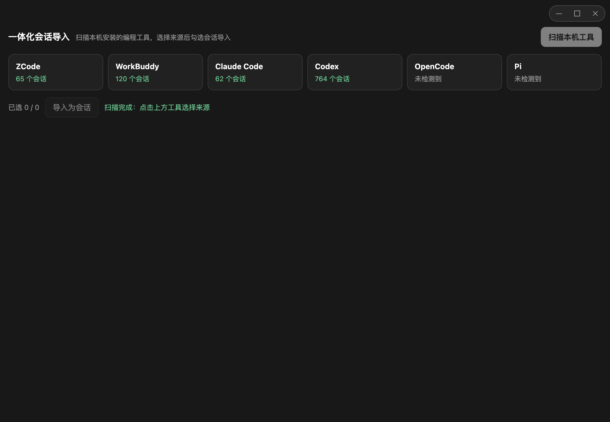
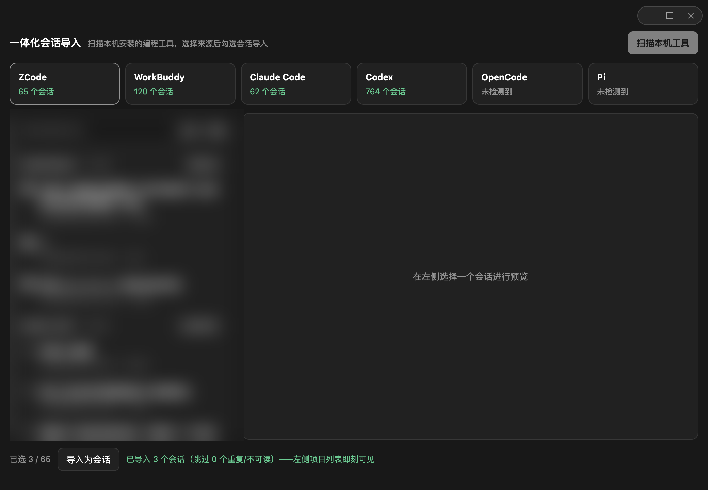
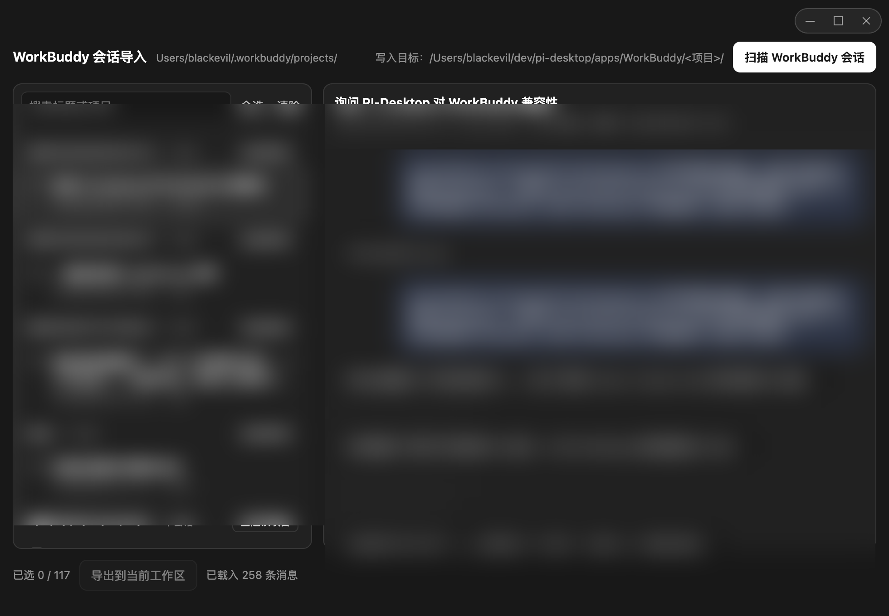
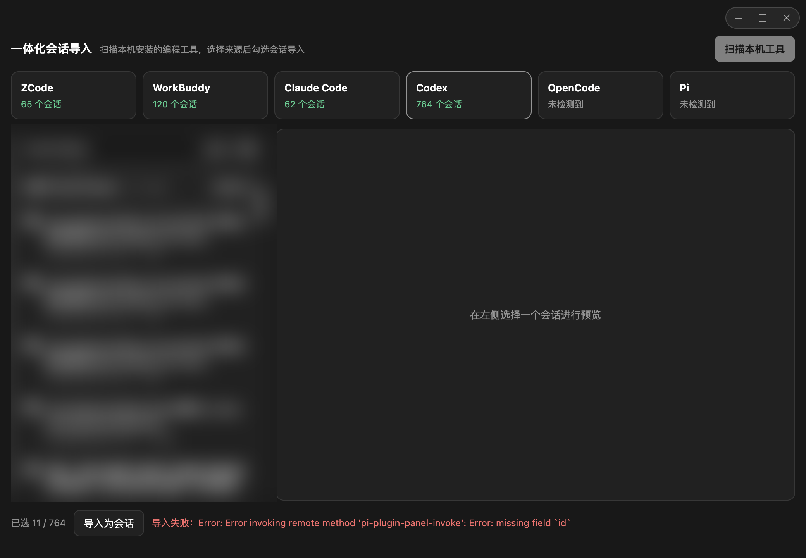
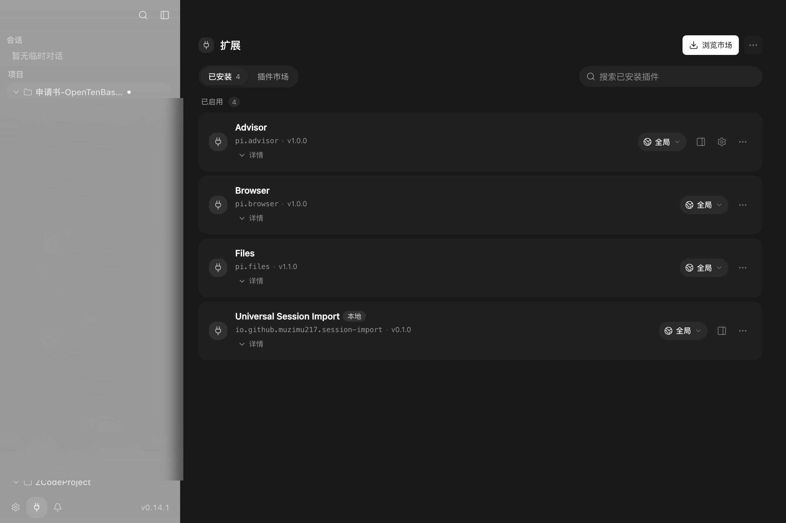

# Universal Session Import（一体化会话导入）

PI-Desktop 插件：**扫描本机安装的编程工具，把它们（ZCode、WorkBuddy、Claude Code、Codex、OpenCode、Pi）的本地会话统一导入 PI-Desktop。**



## 使用流程

### 1. 扫描本机工具

打开面板点击「扫描本机工具」，插件并行探测六个来源，实时显示各自检测到的会话数（未安装的工具显示「未检测到」）。

### 2. 选择来源，浏览会话

点击检测到的工具卡片，按项目分组载入该来源的会话列表（支持搜索、整组全选）：



### 3. 预览对话

点任意会话即可按原始顺序还原完整对话——用户消息、助手回复、工具调用（参数 + 结果折叠展示，错误标红）：



### 4. 导入为会话

勾选会话（支持整组全选）→「导入为会话」，通过宿主 `session.import` 通道写入 PI-Desktop 会话库：



导入的会话按**原始工作目录**归属项目：该项目已在 PI-Desktop 打开时**立刻展开可见**；未打开的项目也会自动加入左侧项目列表并展开：




重复导入自动跳过（幂等 id：`import-<来源>-<外部会话 id>`）。

## 来源与特殊处理

| 来源 | 数据位置 | 特殊处理 |
| --- | --- | --- |
| ZCode | `~/.zcode/cli/db/db.sqlite` | `node:sqlite` 只读；过滤 `subagent_child` 内部会话与 `synthetic` 注入文本；工具调用按存储顺序还原 |
| WorkBuddy | `~/.workbuddy/projects/**/*.jsonl` | 剥离 `<system-reminder>`/`<cb_summary>` 注入块；`function_call` 按 `callId` 配对；外置大结果安全回读；`ai-title` 优先 |
| Claude Code | `~/.claude/projects/**/*.jsonl` | 过滤 sidechain 与合成用户行；`tool_use`/`tool_result` 配对 |
| Codex | `~/.codex/sessions/**/*.jsonl` | 兼容新旧两种格式；过滤 `# AGENTS.md` 等合成行 |
| OpenCode | `~/.local/share/opencode/storage/` | message→part 按 `time.created` 还原 |
| Pi | `~/.pi/agent/sessions/**/*.jsonl` | `toolCall`/`toolResult` 配对；`session_info.name` 优先 |

## 权限

仅需 `ui.panel` / `ui.view`。读取本地数据由插件进程只读完成；**导入**经由宿主
`session.import` 桥接完成（该通道为插件宿主的新增底层 API 提案，见
[PI-Desktop#134](https://github.com/vastsa/PI-Desktop/issues/134)），插件自身不申请
任何文件系统写权限、不联网。

## 开发

```bash
# 在 PI-Desktop 仓库内校验与打包
pnpm --filter @pi-desktop/plugin-devkit... build
node packages/plugin-devkit/dist/cli.js check /absolute/path/to/pi-desktop-session-import
node packages/plugin-devkit/dist/cli.js pack  /absolute/path/to/pi-desktop-session-import
```

在 PI-Desktop 中：插件页 → Load development plugin → 选择本目录。

## License

MIT
